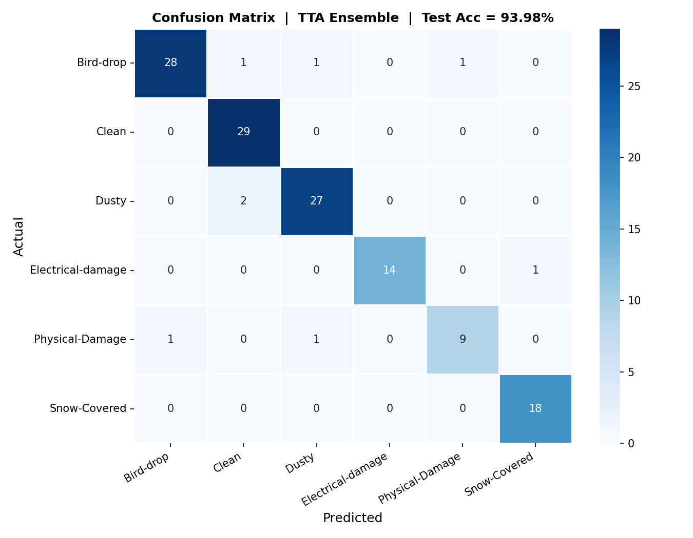
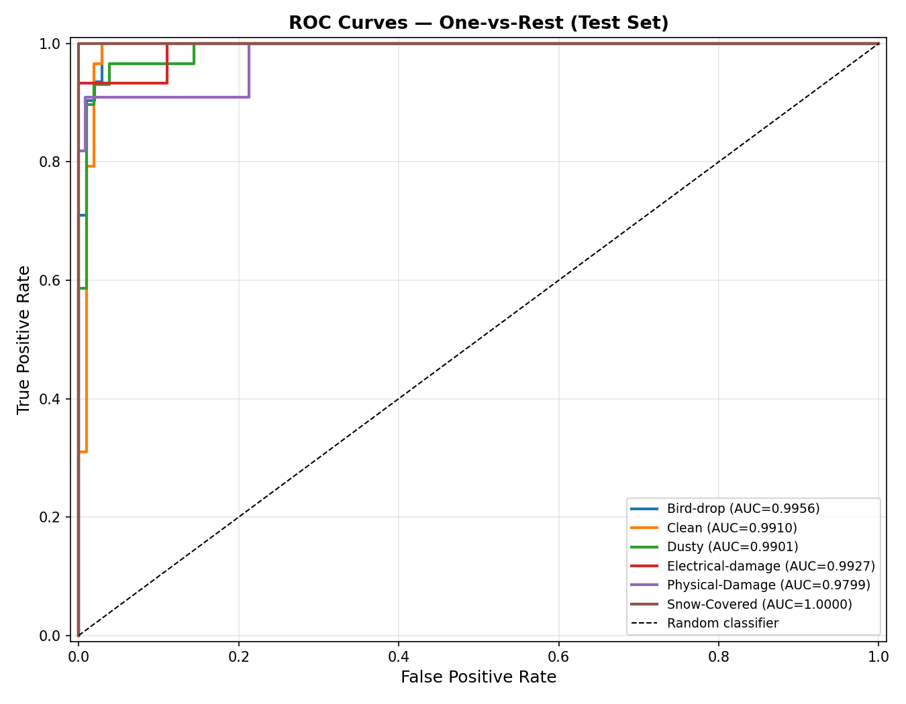
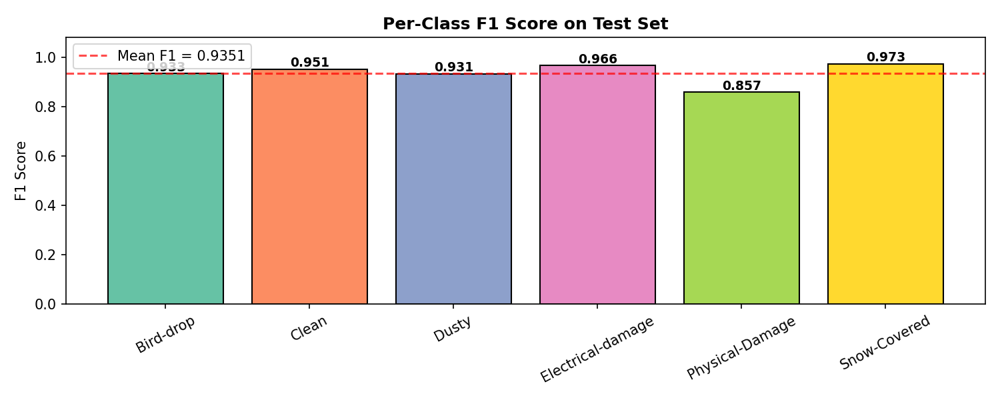
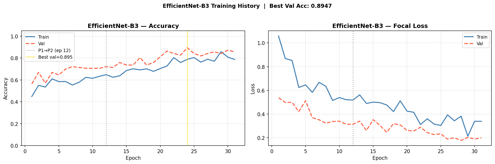
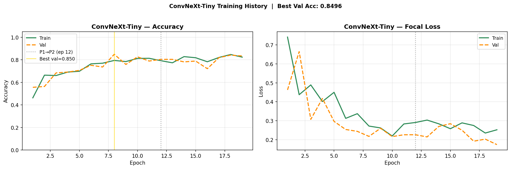
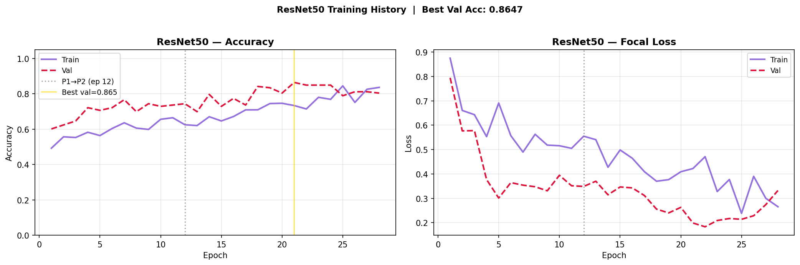
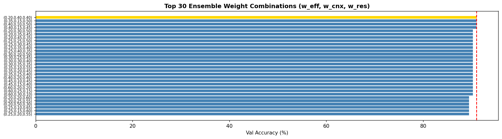
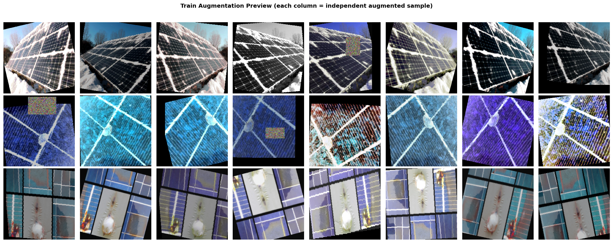
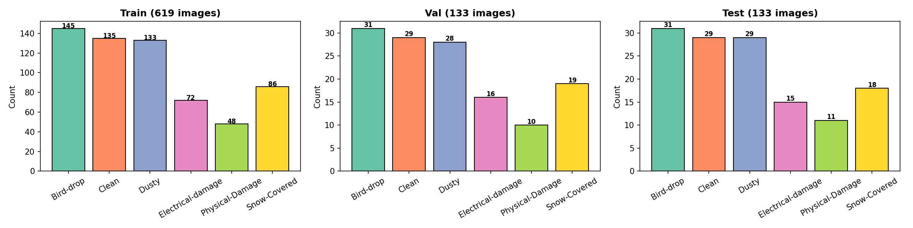

# Solar Panel Surface Fault Classification
### Tri-Model Heterogeneous Ensemble · Deep Learning · Computer Vision

[](.)
[](.)
[](.)
[](.)
[](.)

---

## Problem Statement & Motivation

Solar panel efficiency is directly impacted by surface contamination and physical damage. Dust, bird droppings, snow, cracks, and electrical faults can **reduce power output by up to 70%**. Traditional monitoring through periodic manual inspection is expensive and unscalable across large solar farms.

This project uses deep learning image classification to automatically identify fault types, enabling:
- ⚡ **Automated continuous monitoring** without human intervention
- 🧹 **Targeted cleaning** — only faulty panels addressed
- 💰 **Reduced maintenance costs** and smarter use of resources
- 📈 **Higher energy yield** through timely fault remediation

---

## Classification Task

Given an image of a solar panel, the system classifies it into one of **six fault categories**:

| Class | Description |
|---|---|
| 🐦 **Bird-drop** | Bird droppings on the panel surface |
| ✅ **Clean** | No surface fault |
| 🌫️ **Dusty** | Dust accumulation reducing surface transmission |
| ⚡ **Electrical-damage** | Internal electrical damage visible from surface patterns |
| 🔨 **Physical-Damage** | Cracks, chips, or structural breaks |
| ❄️ **Snow-Covered** | Panel surface obscured by snow |

This is a **fine-grained visual classification problem** — subtle differences between classes (e.g., dust vs. bird-drop) require a sophisticated multi-model approach.

---

## Results

### Final Performance (Held-Out Test Set, Never Seen During Training)

| Metric | Value |
|---|---|
| **Test Accuracy (TTA Ensemble)** | **93.98%** |
| **Macro AUC (One-vs-Rest)** | **0.9915** |
| **Macro F1 Score** | **0.9351** |
| **Weighted F1 Score** | **0.9393** |
| Optimal Ensemble Weights | EFF=0.20 · CNX=0.40 · RES=0.40 |
| Ensemble Val Accuracy (pre-TTA) | 90.98% |

### Performance Progression

| Stage | Accuracy | Gain |
|---|---|---|
| Best individual model (EfficientNet-B3) | 89.47% val | Baseline |
| Naive equal-weight ensemble | 89.47% val | +0.00% |
| Optimized weighted ensemble (grid search) | 90.98% val | **+1.51%** |
| **+ 5-pass Geometric TTA (Final Test)** | **93.98% test** | **+3.00%** |

> TTA provides the largest single boost (+3.00%), confirming that geometric augmentation at inference significantly improves the ensemble's handling of real-world image variability.

### Per-Class Results

| Class | Precision | Recall | F1 | AUC |
|---|---|---|---|---|
| Bird-drop | 0.9655 | 0.9032 | 0.9333 | 0.9956 |
| Clean | 0.9062 | 1.0000 | 0.9508 | 0.9910 |
| Dusty | 0.9310 | 0.9310 | 0.9310 | 0.9901 |
| Electrical-damage | 1.0000 | 0.9333 | 0.9655 | 0.9927 |
| Physical-Damage | 0.9000 | 0.8182 | 0.8571 | 0.9799 |
| Snow-Covered | 0.9474 | 1.0000 | 0.9730 | **1.0000** |

---

## Evaluation Outputs

### Confusion Matrix


### ROC Curves (One-vs-Rest)


### Per-Class F1 Scores


### Grad-CAM Explainability
> Red regions = most attended · Blue = less important · Each column = different backbone


### Training Curves

<details>
<summary>Click to expand training curves for all three models</summary>

**EfficientNet-B3**


**ConvNeXt-Tiny**


**ResNet50**


**Ensemble Weight Search (Top-30 Val Combinations)**


**Augmentation Preview**


**Class Distribution**


</details>

---

## Dataset

**Source:** [Solar Panel Images by Python Afroz](https://www.kaggle.com/datasets/pythonafroz/solar-panel-images) (Kaggle)

| Class | Total | Train (70%) | Val (15%) | Test (15%) |
|---|---|---|---|---|
| Bird-drop | 207 | 145 | 31 | 31 |
| Clean | 193 | 135 | 29 | 29 |
| Dusty | 190 | 133 | 28 | 29 |
| Electrical-damage | 103 | 72 | 16 | 15 |
| Physical-Damage | 69 | 48 | 10 | 11 |
| Snow-Covered | 123 | 86 | 19 | 18 |
| **Total** | **885** | **619** | **133** | **133** |

> **Physical-Damage** is the most underrepresented class (69 images — 3× imbalance vs. Bird-drop), directly motivating stratified splitting, Focal Loss, and WeightedRandomSampler.

---

## Methodology

```
Raw Images
    ↓
Stratified 70/15/15 Split  (hard leakage assertion)
    ↓
Augmentation Pipeline  (RandAugment + RandomErasing + Mixup)
    ↓
WeightedRandomSampler + Focal Loss  (double imbalance correction)
    ↓
Two-Phase Discriminative Fine-Tuning  (head → backbone)
    ↓
Grid-Search Ensemble Weight Optimization  (val set only)
    ↓
5-Pass Geometric TTA
    ↓
Final Evaluation + Grad-CAM  (test set, opened once)
```

### Technical Specifications

| Component | Implementation |
|---|---|
| **Architectures** | EfficientNet-B3 + ConvNeXt-Tiny + ResNet50 |
| **Data Split** | Stratified 70/15/15 (train/val/test) |
| **Augmentation** | RandAugment + RandomResizedCrop + RandomErasing + Mixup (α=0.3) |
| **Training** | Two-phase (head-only → discriminative fine-tune) |
| **LR Schedule** | Linear warmup (2 ep) + CosineAnnealing |
| **Loss** | Focal Loss (γ=2.0, label smoothing ε=0.05) + per-class weights |
| **Imbalance** | WeightedRandomSampler (data level) + Focal Loss (gradient level) |
| **TTA** | 5 geometric passes: original + H-flip + V-flip + rot90 + rot270 |
| **Ensemble** | Grid-searched optimal weights on val set |
| **Explainability** | Grad-CAM on last conv layer of each backbone |
| **Precision** | AMP (FP16 forward / FP32 weights) + gradient clipping |
| **Platform** | Google Colab (NVIDIA Tesla T4, 16 GB VRAM) |

### Model Architectures & Custom Heads

| Model | In Features | Custom Head | Phase 2 Params |
|---|---|---|---|
| **EfficientNet-B3** | 1,536 | Dropout(0.4)→Linear(1536→512)→SiLU→BN→Dropout(0.3)→Linear(512→6) | ~10.7 M |
| **ConvNeXt-Tiny** | 768 | LayerNorm→Flatten→Dropout(0.4)→Linear(768→256)→GELU→Dropout(0.2)→Linear(256→6) | ~26.9 M |
| **ResNet50** | 2,048 | Dropout(0.4)→Linear(2048→512)→ReLU→BN→Dropout(0.25)→Linear(512→6) | ~23.1 M |

### Hyperparameters

| Parameter | Value | Rationale |
|---|---|---|
| `IMG_SIZE` | 224×224 | Standard ImageNet input; compatible with all backbones |
| `BATCH_SIZE` | 16 | Fits 3 models on T4 without OOM |
| `PHASE1_EPOCHS` | 12 | Sufficient for head convergence on frozen features |
| `PHASE2_EPOCHS` | 28 | Extended budget with early stopping (patience=7) |
| `LR_HEAD` | 2e-3 | High LR for randomly initialized head |
| `LR_BACKBONE` | 4e-5 | 50× smaller — prevents catastrophic forgetting |
| `FOCAL_GAMMA` | 2.0 | Down-weights easy examples; concentrates on hard/rare |
| `MIXUP_ALPHA` | 0.3 | Beta distribution parameter for interpolation |
| `TTA_N` | 5 | Geometric passes at inference |
| `SEED` | 42 | Full reproducibility across all random operations |

---

## Reproducing the Results

### 1. Clone the repository
```bash
git clone https://github.com/aaritmehta15/solar-panel-fault-classification-ensemble.git
cd solar-panel-fault-classification-ensemble
```

### 2. Install dependencies
```bash
pip install -r requirements.txt
```

### 3. Download the dataset
Download from Kaggle and structure it as:
```
data/
├── Bird-drop/
├── Clean/
├── Dusty/
├── Electrical-damage/
├── Physical-Damage/
└── Snow-Covered/
```

### 4. Train (full pipeline)
```bash
python train_all.py --data_dir ./data
```
This runs all 10 steps: data → models → training → weight search → TTA evaluation → Grad-CAM → metadata.

### 5. Evaluate only (if you have checkpoints)
```bash
python evaluate_only.py --data_dir ./data --weights_dir ./DL_IA2_SolarFault_TriEnsemble_Outputs
```

> **Note on checkpoints:** The `.pth` checkpoint files (`convnext_best.pth` = 109.9 MB, `resnet_best.pth` = 96.3 MB, `efficientnet_best.pth` = 45.4 MB) are excluded from this repository because they exceed GitHub's 100 MB file size limit. Run `train_all.py` to regenerate them.

---

## Repository Structure

```
solar-panel-fault-classification-ensemble/
│
├── solar_fault_classifier_tri_ensemble_v2.ipynb   # Original research notebook
│
├── src/                          # Modular Python package
│   ├── config.py                 # All hyperparameters (single source of truth)
│   ├── dataset.py                # Data loading, splits, transforms, DataLoaders
│   ├── models.py                 # EfficientNet-B3, ConvNeXt-Tiny, ResNet50 builders
│   ├── loss.py                   # Focal Loss with label smoothing + class weights
│   ├── train.py                  # Two-phase training engine (AMP + mixup + warmup)
│   ├── ensemble.py               # TTA inference + ensemble weight grid search
│   ├── evaluate.py               # Confusion matrix, F1, ROC/AUC, report
│   └── gradcam.py                # Grad-CAM class and visualization grid
│
├── train_all.py                  # ← Run this to reproduce from scratch
├── evaluate_only.py              # ← Run this with existing checkpoints
├── requirements.txt              # Pinned dependencies
│
└── DL_IA2_SolarFault_TriEnsemble_Outputs/
    ├── confusion_matrix.png
    ├── roc_curves.png
    ├── per_class_f1.png
    ├── gradcam_v2.png
    ├── EfficientNet_B3_curves.png
    ├── ConvNeXt_Tiny_curves.png
    ├── ResNet50_curves.png
    ├── ensemble_weight_search.png
    ├── augmentation_preview.png
    ├── class_distribution.png
    ├── classification_report.txt
    └── run_metadata_v2.json
```

---

## References

1. **Focal Loss** — Lin, T.-Y. et al. *Focal Loss for Dense Object Detection.* ICCV 2017. [arXiv:1708.02002](https://arxiv.org/abs/1708.02002)
2. **Mixup** — Zhang, H. et al. *mixup: Beyond Empirical Risk Minimization.* ICLR 2018. [arXiv:1710.09412](https://arxiv.org/abs/1710.09412)
3. **Grad-CAM** — Selvaraju, R.R. et al. *Grad-CAM: Visual Explanations from Deep Networks via Gradient-based Localization.* ICCV 2017. [arXiv:1610.02391](https://arxiv.org/abs/1610.02391)
4. **ConvNeXt** — Liu, Z. et al. *A ConvNet for the 2020s.* CVPR 2022. [arXiv:2201.03545](https://arxiv.org/abs/2201.03545)
5. **Related Work** — International Journal of Scientific Research in Science and Technology (IJSRST). [IJSRST25123136](Referenced%20Papers/IJSRST25123136.pdf)

---

## Authors

| Name | Roll No. | Branch |
|---|---|---|
| **Aarit Mehta** | 16014223002 | TY AIDS B1 |
| **Devanshu Desai** | 16014223031 | TY AIDS B1 |

*Deep Learning Internal Assessment 2 — Solar Panel Surface Fault Classification*

---

<p align="center">
  <i>Built with PyTorch · EfficientNet-B3 · ConvNeXt-Tiny · ResNet50 · Focal Loss · TTA · Grad-CAM</i>
</p>
